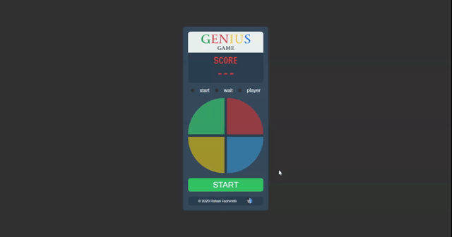

  

 
  
  
  
  

 <a href="#movie_camera-demonstração">Demonstração</a> •
 <a href="#computer-sobre">Sobre</a> •
 <a href="#video_game-controles">Controles</a> •
 <a href="#memo-roteiro">Roteiro</a> •
 <a href="#hammer-tecnologias">Tecnologias</a> •
 <a href="#boy-autor">Autor</a> •
 <a href="#page_facing_up-licença">Licença</a>

---
## :movie_camera: **Demonstração**

<b> :computer: WEB DESKTOP </b>

  <kbd></kbd>

---
## :computer: Sobre

Jogo da memória inpirado no clássico GENIUS. O objetivo é acertar a sequência de cores gerada aleatóriamente o máximo que o jogador conseguir. Não há limites para a quantidade de sequências geradas pelo jogo.

---
## :video_game: Controles

|:keyboard: Controle|:computer: Desktop|:iphone: Mobile|
|:---:|:---:|:---:|
|Selecionar cor|<kbd>Clique com mouse</kbd>|:x:|

---
## :memo: **Roteiro**

Clique para Ver

|      Estado      |     Plataforma   |     Tarefa    |
|      :---:       |       :---:      |      :---     |
|:heavy_check_mark:|:computer:        |Estrutura da página|
|:heavy_check_mark:|:computer:        |Estilização do jogo|
|:heavy_check_mark:|:computer:        |Lógica de controle de geração de sequências|
|:heavy_check_mark:|:computer:        |Controle de repetição|
|:heavy_check_mark:|:computer:        |Início e fim do jogo programado|
|:heavy_check_mark:|:computer:        |Controle de tempo para acionamentos|
|:heavy_check_mark:|:computer:        |Refinação no visual|

---
## :hammer: **Tecnologias**

As seguintes ferramentas foram utilizadas na construção do projeto:

|:computer: Desktop|
|:---:|
|[HTML5](https://developer.mozilla.org/pt-BR/docs/Web/HTML/HTML5)	|
|[CSS3](https://developer.mozilla.org/pt-BR/docs/Archive/CSS3)		|
|[JavaScript](https://www.ecma-international.org/publications/standards/Ecma-262.htm)|

---
## :boy: **Autor**

  

---
## :page_facing_up: **Licença**

  
Copyright © 2021 [Rafael Fachinelli](https://github.com/rafaelfachinelli). 
Este projeto é licenciado pelo [MIT](./LICENSE).

